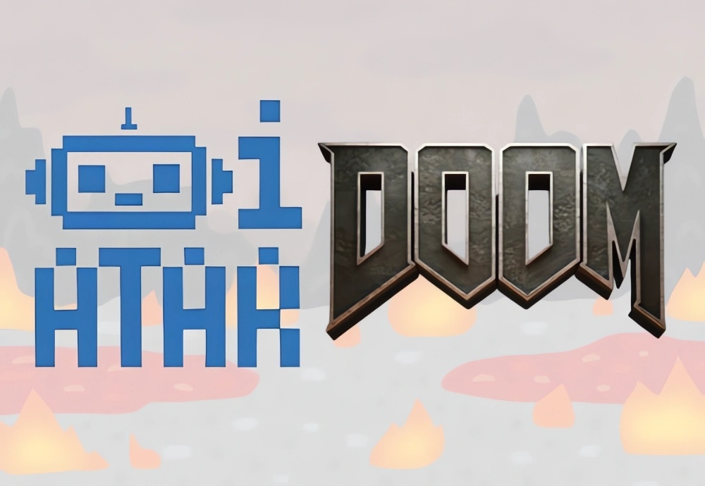

<div align="center">



# 🤖 DOOM - Robot Control Framework

**Unified Interface for Real Robot Control and MuJoCo Real-time Control**

[](https://www.python.org/downloads/)
[](https://docs.ros.org/en/humble/)

[](https://www.docker.com/)
[](LICENSE)
[](https://github.com/Atarilab/DOOM)

*A framework for controlling Unitree robots (Go2, G1) in the real world and in Mujoco real-time using a unified interface.*
</div>

## 📋 Table of Contents

⚙️ [Requirements](#️-requirements) • 📦 [Installation Instructions](#-installation-instructions) • 🤖 [Testing Robot Connection](#-testing-robot-connection-if-running-on-the-robot)

🚀 [How to Use DOOM to Control Your Robot](#-how-to-use-doom-to-control-your-robot) • 🎮 [Joystick Control](#-joystick) • 🗂️ [Task Library](#-task-library)

📡 [Vicon State Estimation](#-vicon-state-estimation) • 📊 [Live Plotting using PlotJuggler](#-live-plotting-using-plotjuggler) • 👁️ [Robot Visualization in RViz](#️-robot-visualization-in-rviz) •

🐞 [Debugging](#-debugging) • 🧹 [Code Formatting](#-code-formatting) • 📦 [Installed ROS2 Packages](#-installed-ros2-packages)

🧩 [DOOM Elements](#-doom-elements)

📝 [TODO](#-todo) • 🤝 [Contributing](#-contributing) • 📚 [Resources](#-resources) 

## ⚙️ Requirements 
- docker (ros2 container with unitree_sdk)
- nvidia Graphics card and [nvidia-container-toolkit](https://docs.nvidia.com/datacenter/cloud-native/container-toolkit/latest/install-guide.html)
  
## 📦 Installation Instructions

### 🛠 Install DOOM
For installation of the DOOM project, run:
```bash
./doom.sh -i
```
The above script, updates all submodules, builds the docker container, and manually sets up a network interface in the same subnetwork as the robot.

### 🐳 Building and running the container
```bash
./doom.sh -b # build
./doom.sh -e # enter
```

For more helpful functions from `./doom.sh`, run:
```bash
./doom.sh -h
```

### 💻 VS Code Workspace Setup
Open VS Code with `unitree_mujoco_container` as the project directory and build the docker container. Additionally, debuggers for certain tasks are already defined in `.vscode/launch.json`.

---

## 🤖 Testing Robot Connection (if running on the robot)

> **Warning:** Before you run anything on the robot, make sure to turn off the sports mode using the Go2 app. Log in to the app using the ATARI Gmail credentials and toggle off **Device > Service Status > sport_mode** as this will interfere with the additional torque commands passed to the robot.
> **Check:** Unitree ros topics should appear by default with 'ros2 topic list'. If not, try restarting your computer.
> 
Once inside the docker container, you can access the Robot's IP address via `$ROBOT_IP`. You can test the connection using:
```bash
ping $ROBOT_IP
```
If the connection is not established, you might need to manually set the IP for the wired connection. You can do so by following the "Configure Network Environment" section [here](https://support.unitree.com/home/en/developer/Quick_start).

If it still doesn't ping the robot after manually configuring the IP, you can check if the right network interface is chosen. Using the USB-Ethernet Adapter, the network interface should have the ID `enx3c4937046061` by default. You can confirm it using `ifconfig` and checking the network interface ID for the corresponding `$ROBOT_IP`. If not, you should manually change it in `.env.base`, `.env.docker`, then delete the existing container using `./doom.sh -d`, rebuild the container using `./doom.sh -b`, enter inside the container using `./doom.sh -e`, and update the ROS2/DDS network interface inside `setup.sh` using the one you found with `ifconfig`. Don't forget to run `source setup.sh` to update them.

---

## 🚀 How to use DOOM to control your robot
The various tasks are defined in [`tasks/task_configs.json`](src/tasks/task_configs.json). Currently, the following tasks are defined and tested:
- `rl-velocity-sim-go2` (Status: ✅ )
- `rl-velocity-real-go2` (Status: ✅ )
- `rl-contact-sim-go2` (Status: ✅ )
- `rl-contact-real-go2` (Status: ✅ )
- `rl-unitree-sim-g1` (Status: ✅ )
- `rl-unitree-real-g1` (Status: 👀 ) - to be tested
- `rl-velocity-sim-g1` (Status: ✅ ) 
- `rl-velocity-real-g1` (Status: 👀 ) - to be tested
- `rl-contact-sim-g1` (Status: ⚠️ )
  
Once you've chosen the task you want to run, you can run the master node to control the robot using:
```bash
ros2 run master_manager master_node --task <insert-task-name>
```
Use the `--ui` argument if you want to use the terminal UI interface. Else, you can also use the joystick to control the robot.

This repository also has a simulation mode, which allows you to run the same scripts with the `unitree_sdk` to send commands to your robot in MuJoCo. Note that MuJoCo is not used as a visualizer for your real robot interface but rather as a sanity test of the same script that you might run on the real robot. It uses a modified version of MuJoCo to behave real-time. 

To launch the simulator, run:
```bash
python3 simulate.py --task <insert-task-name>
```
Example Workflow for `rl-velocity-sim-go2` task: `Standing` > `Stay_down` > `Stand_up` > `Back to Main Menu` > `Locomotion` > `RL-Velocity`

## 🧭 Go2 Blind Locomotion using UI Velocity Commands Example (SIM)
Before you start, make sure there are no other main processes running on your computer. This could cause jittery movements due to imperfect tracking of the PD controllers introduced by the latency from heavy process in the background. Keep an eye out for your CPU utilisation using `htop` to validate this. A simple restart can ensure that you start fresh. 

#### Terminal 1
```bash
./doom.sh -e # enter the container
cd src/
python3 simulate.py --task=rl-velocity-sim-go2
```
#### Terminal 2
```bash
./doom.sh -a # attach a terminal to the existing DOOM container
source setup_local.sh
ros2 run master_manager master_node --task rl-velocity-sim-go2 --ui # use ui for the terminal UI interface (additionally, we can also manage commands to the robot via joystick with/without UI)
```
ZERO mode is used to send zero torques to the robot. DAMPING mode is a damping mode to gracefully stop commands to the robot.
STAND modes are used to initialise the robot to its default positions using simple PD controllers. Click on `STAND`, and then `STAY_DOWN`. This makes the robot stay in a crouched position close to the ground. After it stabilises, click on `STAND_UP`, which is a phase-based PD controller that makes the robot stand up to the default joint configuration. `STAND_DOWN` is also a phase-based PD controller that moves from the standing up joint configuration to the crouched joint position, as in `STAY_DOWN`.

> Note: Since these `STAND` modes are phase-based PD controllers, allow them to stabilise before switching to other modes.

> Note: The UI terminal window may need to be resized to see the different modes. If using [Terminator](https://gnome-terminator.org/), you can use `Ctrl+Shift+X` for full screen and `Ctrl + MouseScroll` to adjust the window dimensions to fit your screen

Now that the robot is in the `STAND_UP` configuration, go back to the Main Menu from the UI, choose `LOCOMOTION`, and then `RL-VELOCITY`. This will start the velocity command based blind RL locomotion policy at zero velocity. From the UI, you can now enter the X, Y velocities and the yaw rates for fixed command velocities.

## 🦿 Go2 Blind Locomotion using UI Velocity Commands Example (REAL)
The only change for running on the real robot is launching the Vicon client to get the base states instead of launching the simulator, and using the correct task name for the real experiments. The rest is taken care of by DOOM to maintain the same interface to run experiments in sim (MuJoCo) and on the real robot.

#### Terminal 1
Launch Vicon client that publishes the base states
```bash
./doom.sh -e # enter the container
ros2 launch vicon_receiver client.launch.py
```

#### Terminal 2
```bash
./doom.sh -a # attach a terminal to the existing DOOM container
source setup.sh
ros2 topic list # view available topics, confirm if you can view topics published by the robot and by the vicon
ros2 run master_manager master_node --task rl-velocity-real-go2 --ui # use ui for the terminal UI interface (additionally, we can also manage commands to the robot via joystick with/without UI)
```

#### Terminal 3 (optional)
Use plotjuggler to view topics in real time plots
```bash
./doom.sh -a # attach a terminal to the existing DOOM container
source setup.sh
ros2 run plotjuggler plotjuggler
```

#### Terminal 4 (optional)
Robot Visualization in RViz
```bash
./doom.sh -a # attach a terminal to the existing DOOM container
source setup.sh
ros2 launch go2_description go2_visualization.launch.py
```

## 🎮 Joystick 
Alternatively, to send commands to the robot, users can also use the joystick. Make sure that the Docker container is launched with the joystick already connected. Otherwise, you will need to rebuild the container and enter again.
There are some common joystick configurations to handle the mode-switches:

Select: Any -> `ZERO`

Start: `ZERO`/`DAMPING` -> `STAY_DOWN`

Start: AnyElse -> `IDLE`

Up: `STAY_DOWN`/`STAND_DOWN` -> `STAND_UP`

Down: `STAND_UP` -> `STAND_DOWN`

Down: `STAND_DOWN` -> `STAY_DOWN`

L1+R1: `STAND_UP` -> `RL-VELOCITY` 

You can further define controller-specific joystick mappings by defining `get_joystick_mappings` (See RL-Contact Controller for reference).

## 🗂️ Task Library
<div align="center">

| <div align="center"> rl-contact-real-go2 </div> | <div align="center"> rl-contact-sim-go2 </div> |
| --- | --- |
| [](rl-contact-real-go2) | [](rl-contact-sim-go2) |

</div>


## 📡 Vicon State Estimation
The Vicon receiver client is already installed in the Docker container. You can launch it in a new terminal inside the existing container (`./doom.sh -a`) using:
```bash
ros2 launch vicon_receiver client.launch.py
```

## 📊 Live Plotting using PlotJuggler
```bash
ros2 run plotjuggler plotjuggler
```

## 👁️ Robot Visualization in RViz
Visualizing in RViz is useful, especially for debugging, to see what the world looks like to the robot. Once the master node is launched in a terminal, you can launch RViz in another terminal using:
```bash
ros2 launch go2_description go2_visualization.launch.py
```

## 🧹 Code Formatting
This project uses [black](https://github.com/psf/black) as the code formatter and [flake7](https://github.com/PyCQA/flake8) as additional linter to ensure consistent code style across the codebase. You can run the formatter inside the container in VS Code (or other forks like Cursor, Windsurf etc.) using the keyboard shortcut `Ctrl + Shift + B` and running the task `Format and Lint`.

## 🐞 Debugging
A logger is available throughout almost every part of the project. You can print debug logs using `logger.debug()` or info logs using `logger.info()`. Unless in debug mode, the debug logs won't appear on the terminal. It will only be saved to `src/logs`. The debug mode can be turned on using `--debug` argument in launching the master node, such as 

```
ros2 run master_manager master_node --task rl-velocity-real-go2 --log velocity_real --debug
```
When running in debug mode, it is also possible to add breakpoints inside threaded functions (we set `daemon=False`). We highly recommend using a debugger such as the one existing in VSCode (`debugpy`) to add breakpoints and debug the code.

## 📦 Installed ROS2 Packages
- [unitree_sdk](https://github.com/unitreerobotics/unitree_sdk2)
- [unitree_sdk_python](https://github.com/unitreerobotics/unitree_sdk2_python)
- [ros2-vicon-receiver](https://github.com/Atarilab/ros2-vicon-receiver.git)

## 🧩 DOOM Elements
### 🧠 [Master Manager](src/master_manager/master_manager/master_node.py)
The master manager is the entry point of DOOM. It loads up the necessary configurations based on the arguments you provide to it, the main one being the `task`, used to resolve the task, robot and interface (sim/real). For example, `rl-velocity-sim-go2` is used to resolve the robot: Go2, the interface: simulation, the controller type: rl, and the method: contact. It follows the convention: `<controller-type>-<method>-<interface>-<robot>`
. The available configs are defined in [`task_configs.py`](src/tasks/task_configs.py) and can be appended with new ones for new tasks. 

[`LowLevelCmdPublisher`](https://github.com/Atarilab/DOOM/blob/main/src/master_manager/master_manager/low_level_cmd_publisher.py) is the ROS2 node inside the `master_manager` that runs the main program loop inside the callback. Essentially, it updates the states and passes them to the controller that is active, which returns low-level commands which could be in the form of PD targets or torques. The low-level commands are then published through the unitree communication channel (which uses DDS), to either the simulation interface or real robot interface (which are automatically resolved from the task name). Optionally, the UI Interface can be run concurrently with the `LowLevelCmdPublisher` inside `master_manager` using the `ui` argument.

### 📈 [State Manager](src/state_manager/state_manager/state_manager.py)
The state manager is responsible for listening to different ROS2/DDS topics. Each subscriber also has callbacks/handlers which are defined in [`state_manager/msg_handlers.py`](src/state_manager/state_manager/msg_handlers.py). The state manager then makes these states available to your controllers in the form of a dictionary.

### 🔁 [Mode Manager](src/utils/mode_manager.py)
The mode manager is used to switch between different modes or controllers which are available to the robot based on the `task`. By default, there are the `ZERO` and `DAMPING` modes available across DOOM for all tasks, which are used to send zero torques and damping torques, respectively. When starting the robot, it is useful to have these modes to initialise the robot to some default safe poses, and then switch to the mode/controller that you developed. For example, for the task `rl-velocity-sim-go2`, apart from the default zero and damping modes, also has standing controllers. These are phase-based PD controllers that can stabilise and bring the robot to default positions. Once ready, you can then switch to the `RL-VELOCITY` mode/controller.

### 👀 [Observation Manager](src/state_manager/state_manager/obs_manager.py)
Each controller also has an optional observation manager. This is different from the state manager. The states are what you directly subscribe to through ROS2/DDS topics. However, you may sometimes need to create additional observations based on the states you have. For example, in RL routines, it is common to have a projected gravity vector as an observation instead of using quaternions for the base orientation. These can be defined as a function that computes the projected gravity vector from the states. You need to register the required observations in your controller to use this. Additionally, you can also pass  additional params to the observation functions. The observation manager is especially useful for RL since you can register the observations in your RL Controller class, and it can directly compute a vector of observations (respecting the order in your registration) that can be directly given to your policy to compute the action. If you are familiar with the `ObservationManager` in IsaacLab, this is exactly what that does. Additionally, the RL routines have separate threads for policy inference and observation processing and gets the latest policy action inside the `compute_lowlevelcmd()`. 

### 🦾 [RobotBase](src/robots/robot_base.py)
The robot class defines robot-specific data. This is also where you define the available controllers and the subscribers for your task and robot, based on the task name. You also have access to a MuJoCo wrapper with `robot.mj_model`. The robots supported now are Unitree Go2 and G1. You can check out `robots/<robot-name>/<robot-name>.py` for more robot-specific information.

### 🎯 [ControllerBase](src/controllers/controller_base.py)
This is a base controller class that needs to be inherited if you need to define your own controller. In the barest form for creating a new controller, all you need is to inherit the `ControllerBase` and complete the `compute_lowlevelcmd` function, that has access to the states that you subscribe to, and you can compute the desired motor commands in the form of PD targets or torques and pass return it. An example of this can be seen in the `ZeroController` or the `DampingController`. Then you need to make the controller available in your robot class in its corresponding `available_controllers`.

Note: By default, it is not a ROS2 node. However, you can convert it into one by also inheriting from `Node` in `rclpy.node`. Usually, this is only required if you want to visualise something from inside your controller. If you need more info on doing this, check out the `RLControllerBase`.

### 🎮 [Joystick Interface](src/utils/joystick_interface.py)
The joystick interface is used to switch between different modes/controllers and also to send commands to the controller. There are already some common joystick transitions defined to switch across the different modes. Additionally, you can add your own joystick mappings inside your controller by adding them in `get_joystick_mappings()`. Pay attention to not overriding existing joystick mappings for damping and zero modes for safety reasons.

### 🖥️ [RobotControlUI](src/utils/ui_interface.py)
This is an optional UI Interface that allows you to choose different modes and send commands to the robot from Terminal UI. In DOOM, we recommend using the joystick instead, since the UI contributes to additional CPU overhead.

Note: This is a research prototype. Use at your own risk.

### 👥 Contributors

<a href="https://github.com/shafeef901">
  
</a>
<a href="https://github.com/OliEfr">
  
</a>

## 📝 TODO
- [ ] Test g1 bimanual manipulation policy
- [ ] Add support for AlienGo/Allegro
- [x] Add controller for tuning the PD gains of G1
- [x] Add RViz visualization for G1
- [x] Add g1 velocity locomotion Policy from unitree example (rl-unitree-sim-g1) and IsaacLab (rl-velocity-sim-g1)
- [x] Create table with box env for G1
- [x] Implement simple stand up, stand down controllers for G1
- [x] Add G1 in sim
- [x] Optional Terminal UI Interface
- [x] Test RViz on the real robot for contact-conditioned policy (stance, trot in place)
- [x] Implement joystick control for controller-specific commands
- [x] Implement joystick control for switching between common modes
- [x] Implement a real-time High-Level Contact Planner
- [x] Publish robot and joint states to corresponding topics from master node
- [x] Visualize Robot in RViz
- [x] Implement interface to change commands from UI
- [x] Implement safety mechanisms (soft dof pos limits, dof torque limits)
- [x] Get vicon frame from Vicon SDK and transform to robot base (directly using base position from vicon after [**@victorDD1**](https://github.com/victorDD1)'s update)
- [x] Add mechanism for real-time state logger and plotter (debug logger in console and file, plotjuggler for ros topics)
- [x] Test Velocity-conditioned policy


## 📚 Resources
Unitree Guide: https://support.unitree.com/home/en/developer/Quick_start
